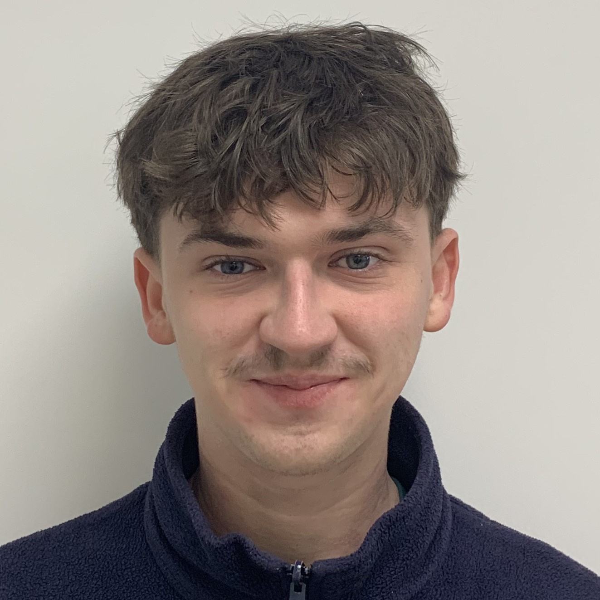

# Jolivet Arthur                                                               

**Alternant en Infographie**

📞- 0782946660

📧- jolivetarthur1@gmail.com

[LinkdeIn:](https://www.linkedin.com/in/arthur-jolivet-221ab6223)

Mon Univers: **https://shorturl.at/EFM09**

## A propos de moi
Étudiant dans le secteur de la communication numérique. Passionné et motivé par le milieu du design graphique et de la communication digitale de manière plus générale. 
Je suis à la recherche de nouvelles opportunités pour acquérir de l'expérience et de nouvelles compétences.

## Formation
**2021-2024:** BUT Information numérique des organisations, IUT BORDEAUX MONTAIGNE
**2021:** Obtention du Baccalauréat mention assez bien, spécialités histoire des arts et SES, LYCÉE LOUIS DE BROGLIE

## Expérienes professionnelles
**Avril-Juin 2023:** STAGE - COMMUNICATION DIGITALE
- Créations graphiques & sonores
- Utilisation du CMS WordPress
- Montage vidéo

**Août 2022:** CDD - EMPLOI D'ÉTÉ, France Galop
- Envoi de courrier 
- numérisation de documents

**Mai-Juin 2022:** STAGE - COMMUNICATION DIGITALE, France Galop
- Traitement de données
- Création d'un formulaire de concours
- Rédaction de posts pour les réseaux sociaux

**Décembre 2021-Mars 2022:** Equipier polyvalent en service et cuisine, McDonald's
Equipier polyvalent en service et cuisine

## Compétences 
- Graphisme
- Photographie
- Community management
- Gestion de caisse
- Production musicale
- Travail en équipe

## Outils
- Suite Adobe (Photshop, Illustrator, InDesign)
- Fl Studio
- Zotero
- Zettlr
